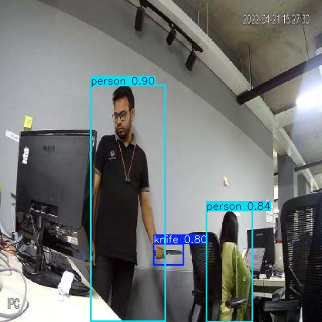
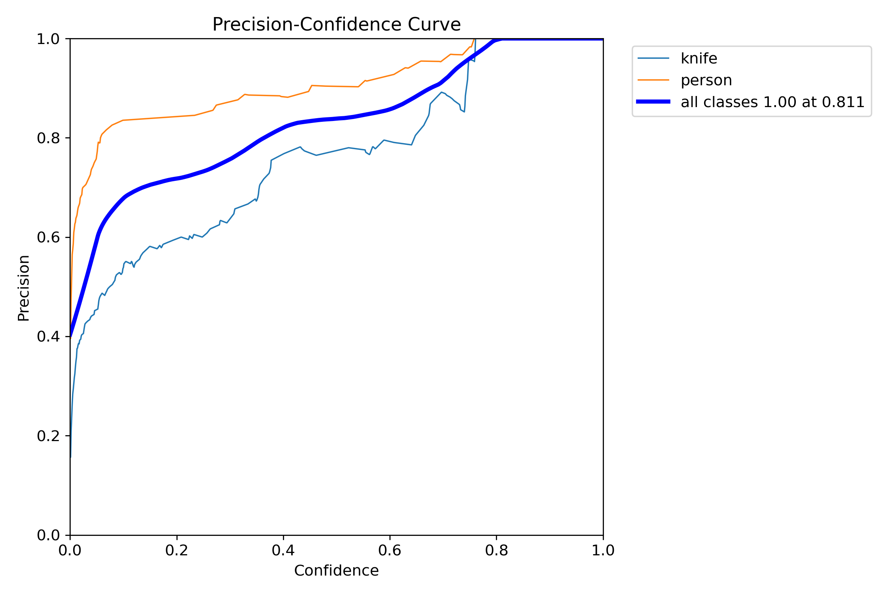
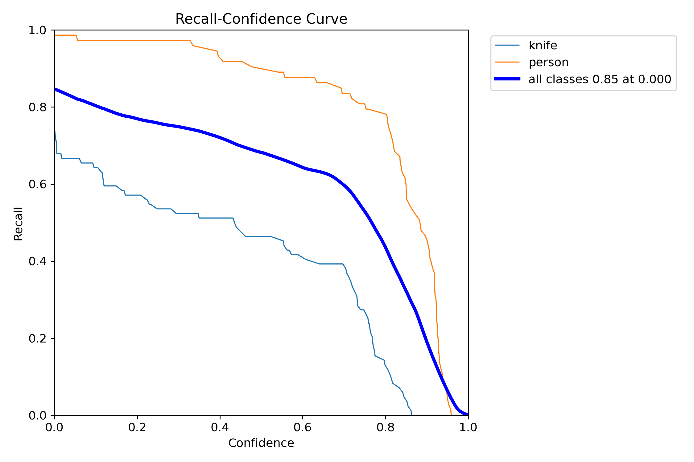
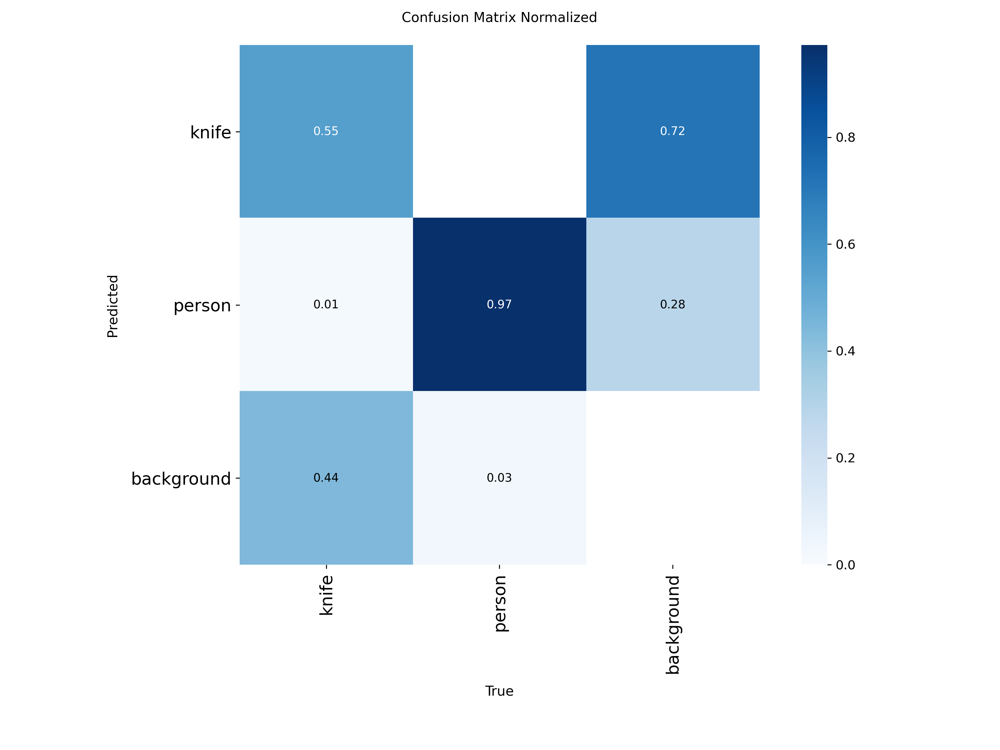

# Knife Detection with YOLOv11

本项目基于 Ultralytics YOLOv11 框架，完成了"拿刀人"视觉检测模型的训练任务。模型能有效检测图像中的"knife"和"person"类别，适用于安防和监控场景。

---

## 项目简介

- **检测框架**：YOLOv11 (Ultralytics 版本 8.3.172)
- **数据集规模**：400张标注图片，包含两类目标：`knife` 和 `person`
- **类别数量**：2
- **训练设备**：NVIDIA GeForce RTX 4070 Laptop GPU + CUDA 11.8
- **训练轮数**：100 epochs
- **图像尺寸**：640×640

---

## 目录结构

ultralytics-main/
├── .github/
├── docker/
├── docs/
├── examples/
├── tests/
├── ultralytics/
├── knife_dataset/              # 你的数据集和配置文件
│   ├── train/
│   │   ├── images/
│   │   └── labels/
│   ├── valid/
│   │   ├── images/
│   │   └── labels/
│   ├── test/
│   │   ├── images/
│   │   └── labels/
│   └── data.yaml                          # 数据集配置文件
├── runs/                                 # 训练和推理结果文件夹
│   └── detect/
│       ├── train5/                       # 训练过程输出
│       │   └── BoxP_curve.png
│       └── predict/                      # 推理过程输出
│           ├── 25_jpg.rf.843db44eb00ed3c7a8b29f9772182ad0.jpg
│           └── ...                      # 其他推理生成的文件
├── dockerignore
├── .gitignore
├── CITATION.cff
├── CONTRIBUTING.md
├── LICENSE
├── mkdocs.yml
├── pyproject.toml
├── README.md
├── README.zh-CN.md
└── yolo11m.pt                            # 预训练模型权重文件


---

## 环境激活

使用 Anaconda 25.5.1管理环境，运行项目前请先激活环境：

```
bash
conda activate yolo11-env

---

## data.yaml 内容

```yaml
train: train/images
val: valid/images
test: test/images
nc: 2
names: ['knife', 'person']
```

---

## 环境配置

推荐使用 Python 3.10，PyTorch 2.0.1 + CUDA 11.8。  
安装依赖：

```bash
pip install -r requirements.txt
```

---

## 模型训练

### 训练命令

```bash
yolo detect train model=yolo11m.pt data=D:/ultralytics-main/ultralytics-main/knife_dataset/data.yaml epochs=100 imgsz=640
```

---

## 模型评估指标

验证集结果如下：

| 类别   | Precision | Recall | mAP@0.5 | mAP@0.5:0.95 |
|--------|-----------|--------|---------|--------------|
| all    | 0.822     | 0.729  | 0.787   | 0.569        |
| knife  | 0.760     | 0.512  | 0.602   | 0.303        |
| person | 0.885     | 0.947  | 0.972   | 0.834        |

- 模型整体检测效果良好，`person` 类表现尤为突出；
- `knife` 类召回率相对较低，建议结合实际场景进一步优化。

---

### 推理效果示例

下图展示模型对测试图片的检测结果（已成功识别出 person 和 knife）：



---

### 模型训练指标图

**精确率（Precision）变化曲线**  
用于衡量模型预测为正类时的准确程度：



**召回率（Recall）变化曲线**  
用于衡量模型捕捉所有正类目标的能力：



**混淆矩阵（归一化）**  
展示两个类别（knife 和 person）的分类准确性：



### 多张图像预测

```bash
yolo detect predict model=runs/detect/train5/weights/best.pt source=D:/ultralytics-main/ultralytics-main/knife_dataset/test/images/
```

---

## 使用建议

1. 确保安装所有依赖：
```bash
pip install -r requirements.txt
```
2. 对于knife类别的检测，建议增加更多样化的训练数据
3. 可尝试调整置信度阈值以获得更好的检测效果

---

## 联系方式

- 姓名：简健怡  
- 电话：133-0223-0173  
- 提交时间：2025年8月3日  
- 如有进一步评估需求或技术交流，欢迎联系。


